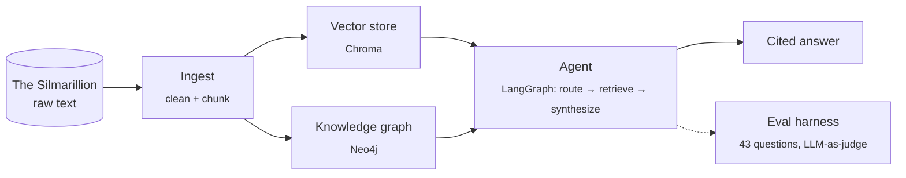
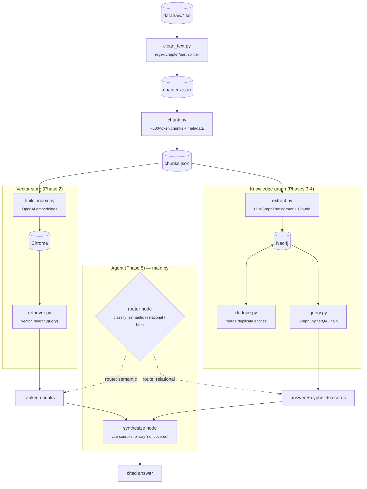
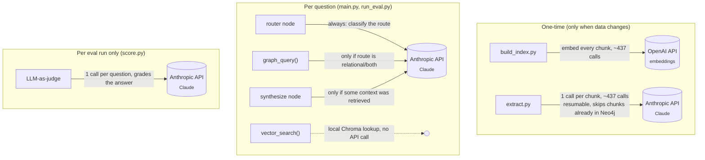
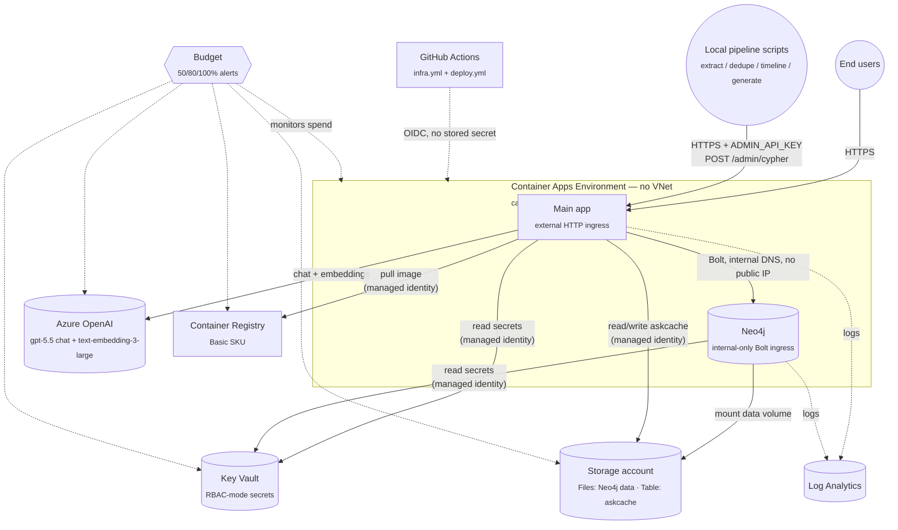

# Silmarillion Agent

A RAG + knowledge-graph system over the text of *The Silmarillion*: semantic
search via a vector store, and structured relationship queries (genealogy,
alliances, aliases) via a Neo4j knowledge graph.

All 6 build phases (ingest → vector store → knowledge graph → Cypher query
layer → LangGraph agent → eval harness) are done. `main.py` is the single
"ask a question, get a cited answer" entrypoint (see below); the vector
store and graph can also still be queried independently. Current numbers
and a running list of what's been tuned live in [Evaluation](#evaluation).

## License & attribution

This is an unofficial, non-commercial fan project — not affiliated with or
endorsed by the Tolkien Estate, HarperCollins, or Amazon. The text and
characters of *The Silmarillion* belong to their respective rights holders;
`data/raw/` contains the book's text for this project's own ingestion
pipeline only, and isn't served by any app route (`src/api/app.py` only
mounts `/static` and `/illustrations`). Illustrations under
`data/processed/illustrations/` are AI-generated (Azure OpenAI
`gpt-image-1`) fan art inspired by the book's descriptions, not official
artwork.

## How it works



## Architecture



- **Vector store**: `text-embedding-3-large` embeddings, Chroma, persisted to
  `data/processed/chroma_db/`.
- **Graph**: Neo4j (Docker), entities constrained to a fixed schema
  (`src/graph/schema.py`: `Vala, Maia, Elf, Man, Dwarf, Place, Object, Event,
  House` / `PARENT_OF, SPOUSE_OF, RULED, CREATED, ALLIED_WITH, ENEMY_OF,
  ALSO_KNOWN_AS, ...`). Extraction runs async with bounded concurrency and is
  resumable (skips chunks already in Neo4j).
- **Config**: all env vars, model names, and paths in `src/config.py`.

## API calls & cost

Two APIs are used, for different jobs, at very different frequencies:



So a single `main.py` question costs **1-3 Anthropic calls** (router always;
Cypher generation only if the route touches the graph; synthesis only if
context came back — the "not covered" path skips it entirely) and
**0 OpenAI calls** (vector search reuses the already-built index; OpenAI is
only hit when re-embedding chunks in `build_index.py`).

A full eval run costs more: `run_eval.py` sends all 43 questions through the
agent (up to 3 Anthropic calls each), then `score.py` grades all 43 answers
with an LLM judge (1 more Anthropic call each) — up to **~170 Anthropic
calls per eval+score cycle**. The accuracy-improvement pass this project
went through re-ran that full cycle after every change to check for
regressions (6 rounds), plus assorted one-off `graph.query`/`timeline`
testing — that repeated evaluation, not graph extraction, is the likely
source of any noticeable API spend, since extraction itself is a one-time,
resumable job that skips chunks already in Neo4j.

## Setup

Requirements: Python 3.12+, [uv](https://docs.astral.sh/uv/), Docker.

```bash
cp .env.example .env
# fill in OPENAI_API_KEY, ANTHROPIC_API_KEY, NEO4J_PASSWORD
```

Start Neo4j (with the APOC plugin, required by both extraction and querying):

```bash
docker run -d --name silmarillion-neo4j \
  -p7474:7474 -p7687:7687 \
  -e NEO4J_AUTH=neo4j/<your NEO4J_PASSWORD> \
  -e NEO4J_PLUGINS='["apoc"]' \
  -e NEO4J_dbms_security_procedures_unrestricted=apoc.\* \
  -v "$(pwd)/data/processed/neo4j_db:/data" \
  neo4j:latest
```

`uv run` picks up dependencies automatically — no separate install step.

## Try it

### 1. Ingestion (regenerates `data/processed/*.json`)

```bash
uv run python -m src.ingest.clean_text
uv run python -m src.ingest.chunk
```

### 2. Vector search

```bash
# (re)build the index — needed once, or after re-chunking
uv run python -m src.vectorstore.build_index

# query it
uv run python -m src.vectorstore.retriever "the creation of the Silmarils"
```

Returns the top 5 matching chunks with chapter/part labels. Pure semantic
similarity — no LLM synthesis, so it won't traverse relationships (see graph
below for that).

### 3. Knowledge graph

```bash
# (re)run extraction — resumable, only processes chunks not yet in Neo4j.
# Automatically runs dedupe.py at the end (merges duplicate entities from
# inconsistent LLM spelling); no separate step needed.
uv run python -m src.graph.extract

# link known events to a hand-curated era timeline (fills HAPPENED_DURING
# gaps LLM extraction can't reliably infer from implicit prose chronology)
uv run python -m src.graph.timeline

# ask a question in natural language — generates and runs Cypher
uv run python -m src.graph.query "Who are the children of Feanor?"
uv run python -m src.graph.query "Who are the allies of Turin's enemies?"
```

Good test questions: genealogy (`"children of X"`), aliases (`"what is X also
known as"`), multi-hop relations (`"allies of X's enemies"`).

You can also browse the graph directly at **<http://localhost:7474>**
(user `neo4j`, password from `.env`):

```cypher
MATCH (n {id: "Feanor"})-[r]-(m) RETURN n, r, m LIMIT 50
```

### 4. Agent (ask a question, get a cited answer)

```bash
uv run python main.py "Who is Beren?"
uv run python main.py "Who are the children of Feanor, and who are they allied with?"

uv run python main.py "Explain character Fingolfin"

uv run python main.py "Describe location Gondolin"

uv run python main.py "Describe timeline of First Age"

uv run python main.py "Explain Dagor Bragollach event"

# tests the "not covered" path
uv run python main.py "What color was Bilbo Baggins' waistcoat?"
```

Routes the question to the vector store, the graph, or both, then synthesizes
a cited answer — or says plainly that the text doesn't cover it, rather than
guessing.

### 5. Eval (routing accuracy + answer quality)

```bash
# runs data/eval/questions.json through the agent -> data/eval/results.json
uv run python eval/run_eval.py

# routing accuracy + LLM-as-judge quality pass -> data/eval/scored_results.json,
# ends with a PASS/FAIL regression gate and a non-zero exit code on failure
uv run python eval/score.py
```

43 questions, 3 per category from the plan plus 4 deliberately out-of-scope
questions that check the agent declines rather than guesses. See
[Evaluation](#evaluation) below for current numbers and cost per run.

## Evaluation

Current results (43 questions, 3 per category + 4 out-of-scope):
**93% routing accuracy** (40/43), **4.49/5 avg answer quality**
(LLM-as-judge; both fluctuate a few points run-to-run on router/judge
non-determinism). `eval/score.py` ends with a **regression gate**
(routing ≥75%, ≤3 low-quality answers) that exits non-zero on failure —
currently **PASS**. Full detail:
[data/eval/scored_results.json](data/eval/scored_results.json).

Starting point was 82% routing / 4.46 quality on a smaller 28-question set.
Changes made since, each verified by a full eval re-run:

- **Few-shot router examples** (`src/agent/nodes.py`) — 79%→89% routing.
- **`graph_query()` calls only the Cypher-generation step** directly
  instead of the full `GraphCypherQAChain`, skipping its unused built-in
  QA-synthesis call — halves LLM calls per graph question, no quality cost.
- **`src/graph/timeline.py`**, a hand-curated era timeline, since
  `HAPPENED_DURING` extraction was too sparse for ordering questions.
- **`src/graph/templates.py`**, hand-written Cypher for known question
  shapes (family tree, allies-of-enemies, aliases) as a fallback when
  LLM-generated Cypher returns nothing.
- **`extract.py` now runs dedupe automatically**, and the canonical-spelling
  choice prefers whichever variant has more diacritics (closer to the
  book's own orthography, e.g. "Fëanor" over "Feanor") instead of picking
  by graph degree alone.
- Bug fix: `synthesize_node` was storing `response.content` directly, which
  can be a list of content blocks (thinking + text) rather than a plain
  string — now uses `response.text`.

Known open issues (real, not yet fixed — flagged rather than silently
left):

- `quote_01` intermittently misattributes a quote when the exact passage
  isn't in retrieved context.
- `between_01` has been seen getting era ordering backward in one run
  despite correct underlying timeline data.

Fixed since the last full eval run (spot-checked, not yet re-verified with a
full 43-question pass):

- `rel_01`'s undirected-Cypher direction bug — `(n)-[r]-(m)` patterns let
  either named entity bind to either end of the edge, so returning the
  pattern's own aliases could misread e.g. "Thingol PARENT_OF Lúthien" as
  the reverse. `CYPHER_PROMPT` (`src/graph/query.py`) now requires
  `RETURN startNode(r).id, type(r), endNode(r).id` instead, which is
  direction-safe regardless of match order. Verified directly against
  Neo4j: `rel_01` and a second relationships-category question both now
  return/synthesize the correct direction.

## Backups

`data/processed/` (Chroma + Neo4j data) is gitignored — it's regenerable, but
graph extraction is expensive (~437 LLM calls), so back it up rather than
relying purely on re-running it:

```bash
docker stop silmarillion-neo4j
docker run --rm -v "$(pwd)/data/processed/neo4j_db:/data" -v "$(pwd)/backups:/backups" \
  neo4j:latest neo4j-admin database dump neo4j --overwrite-destination --to-path=/backups
docker start silmarillion-neo4j
```

Chroma is just files on disk — zip `data/processed/chroma_db/` directly.

## Azure deployment

`infra/main.bicep` provisions everything the hosted version needs — Azure
OpenAI (`gpt-5.5` chat + `text-embedding-3-large`), a self-hosted Neo4j
Community Edition Container App (replacing local Docker for the deployed
version — same Cypher/APOC surface), Azure Container Registry with
managed-identity pull/push (no stored registry credential), the main app's
Container App, a storage account (Neo4j's data volume, plus a Table Storage
cache for repeated `/ask` questions — see
[Response cache](#response-cache)), and a monthly budget alert.



All of this lives in one resource group (`rg-silmarillion-prod-cac-001`) —
flattened here since nesting a resource-group box around an environment box
that itself contains apps isn't something Mermaid renders reliably. No
stored credentials anywhere in this picture — every arrow labeled "managed
identity" is a user-assigned identity + RBAC role assignment
(`infra/modules/*.bicep`, each grant colocated with the resource it's scoped
to), and GitHub Actions itself authenticates via OIDC federation, not a
stored Azure secret. Neo4j's Bolt ingress is internal-only (see
[Reaching the deployed graph from local scripts](#reaching-the-deployed-graph-from-local-scripts))
— there's deliberately no VNet, Load Balancer, or public IP for it, which is
what the [one-time environment cutover](#one-time-environment-cutover-dropping-the-custom-vnet)
below was for. Two workflows apply this:

- **`.github/workflows/infra.yml`** — `az deployment group create` against
  `infra/main.bicep`. Runs on push to `main` touching `infra/**`, or manually
  via `workflow_dispatch`.
- **`.github/workflows/deploy.yml`** — builds the Docker image, pushes to
  ACR, then `az containerapp update --image ...`. Runs on push to `main`
  touching `src/**`/`Dockerfile`/`pyproject.toml`/`uv.lock`. Never touches
  Bicep, so it can't roll the running image back to `infra.yml`'s
  placeholder default.

Both authenticate to Azure via **OIDC** (`azure/login@v2`, no stored Azure
secret in GitHub) using a federated identity credential scoped to this repo.

### One-time environment cutover (dropping the custom VNet)

A Container Apps environment's VNet integration is set at creation and
can't be changed in place, so removing the custom VNet (previously needed
only for Neo4j's external Bolt ingress — see `infra/modules/environment.bicep`)
meant renaming the environment (`cae-<nameSuffix>-v2` in `infra/main.bicep`)
rather than editing the existing one. Pushing this creates a **new**
environment and redeploys the app + Neo4j Container Apps into it (brief
downtime for both while that happens; the Neo4j data itself is untouched —
it lives on the Azure Files share, a separate resource the new environment
remounts by name). The old `cae-<nameSuffix>` environment and its
auto-managed resource group (the Standard Load Balancer + public IP this
whole change was meant to stop paying for) are **not** deleted
automatically — after confirming the app and `/timeline` work against the
new environment, delete the old one manually:

```bash
az containerapp env delete --name cae-silmarillion-prod-cac-001 \
  --resource-group rg-silmarillion-prod-cac-001 --yes
```

Skipping this step means paying for both environments at once.

### One-time bootstrap (not managed by Bicep, done once via `az`/`gh` CLI)

Bicep only manages resources inside the resource group — it can't create the
Entra ID (Azure AD) objects that let GitHub Actions authenticate in the first
place, and it can't touch GitHub itself. Both had to be set up manually,
once, before either workflow could run:

```bash
# 1. Resource group — created up front (not left to infra.yml's first run)
#    so the deploy service principal's role assignment below can be scoped
#    to just this resource group, not the whole subscription.
az group create --name rg-silmarillion-prod-cac-001 --location canadacentral

# 2. App registration + service principal for GitHub Actions to authenticate as
az ad app create --display-name silmarillion-agent-deploy
az ad sp create --id <appId from step 2>

# 3. Federated credential — trusts GitHub's OIDC token for this repo's main
#    branch, so no client secret is ever stored anywhere.
az ad app federated-credential create --id <appId> --parameters '{
  "name": "github-main-branch",
  "issuer": "https://token.actions.githubusercontent.com",
  "subject": "repo:hosseinnassiri@18518616/silmarillionista@1327133776:ref:refs/heads/main",
  "audiences": ["api://AzureADTokenExchange"]
}'
# NOTE: GitHub switched to this "immutable" owner-ID/repo-ID subject format
# (repo:OWNER@OWNER-ID/REPO@REPO-ID:ref:refs/heads/BRANCH) for repos
# created/touched after 2026-07-15, replacing the old plain
# repo:OWNER/REPO:ref:... format. A mismatch here fails Azure login with
# AADSTS700213. If this repo is ever renamed or transferred, or the
# federated credential is ever recreated from scratch, re-derive the current
# subject from the exact error message on a failed run rather than
# reconstructing it from the repo/owner names.

# 4. Least-privilege role assignment — Contributor scoped to just this
#    resource group, not the subscription. (MSYS_NO_PATHCONV=1 needed on
#    Git Bash for Windows — otherwise it mangles the leading / in --scope.)
MSYS_NO_PATHCONV=1 az role assignment create \
  --assignee-object-id <service principal object id from step 2> \
  --assignee-principal-type ServicePrincipal \
  --role Contributor \
  --scope /subscriptions/<subscription-id>/resourceGroups/rg-silmarillion-prod-cac-001
```

Then, on the GitHub side, three repo secrets (Settings → Secrets and
variables → Actions) — plain IDs, not credentials, since OIDC means there's
no password/key to store:

```text
AZURE_CLIENT_ID       # the app registration's appId, from step 2
AZURE_TENANT_ID       # az account show --query tenantId
AZURE_SUBSCRIPTION_ID # az account show --query id
```

No `NEO4J_*` or registry-credential secrets are needed — Neo4j is
self-hosted inside the same resource group with a password Bicep generates
deterministically at deploy time, and ACR access uses the Container App's
own managed identity rather than a stored PAT/credential.

### Reaching the deployed graph from local scripts

Neo4j has no external ingress — it's reachable over Bolt only from inside
the Container Apps environment (i.e. from the main app itself), which keeps
this deployment from needing a custom VNet + Standard Load Balancer +
public IP billed 24/7 just to expose a rarely-used admin path. To run
`extract.py`/`dedupe.py`/`timeline.py`/`major_events.py`/`illustrations/
generate.py` against the deployed graph instead of your local Docker Neo4j,
set `ADMIN_API_URL`/`ADMIN_API_KEY` in `.env` (see `.env.example`) — these
route every query through the app's authenticated `POST /admin/cypher`
proxy over HTTPS instead of a direct Bolt connection. Leave them blank for
normal local development.

### Response cache

`/ask` is public and unauthenticated, so repeated questions (bots, crawlers,
or just someone retrying the same example) would otherwise pay full Azure
OpenAI cost every time, even though the underlying text never changes.
`src/cache.py` caches by normalized question in an Azure Table Storage table
(`askcache`, on the same storage account as Neo4j's file share — no new
billable resource), keyed with a `CACHE_VERSION` bumped to invalidate
everything after a prompt/model change, plus a 90-day soft-expiry checked at
read time. Illustrations are deliberately **not** cached — `find_illustrations()`
still runs fresh on every request, cache hit or miss.

Scoped to `POST /ask` itself (`src/api/app.py`) — never inside
`src/agent/graph_app.py`'s `ask()`, since that's also called directly by
`main.py` and `eval/run_eval.py`; caching there would silently serve stale
answers to eval reruns instead of exercising the current code/prompts. Auth
is managed identity + RBAC (`Storage Table Data Contributor`, granted in
`infra/modules/storage.bicep`) — no stored account key. Local development is
a no-op by default: `AZURE_STORAGE_ACCOUNT_NAME`/`AZURE_CLIENT_ID` are only
set in the deployed Container App's env (see `.env.example` to point a local
run at the live cache instead).

## Project layout

```text
main.py                      # CLI entrypoint: ask(question) -> cited answer
src/
├── cache.py                 # /ask response cache (Table Storage; see Response cache)
├── config.py               # env vars, model names, paths
├── ingest/
│   ├── clean_text.py       # raw .txt -> data/processed/chapters.json
│   └── chunk.py            # chapters.json -> data/processed/chunks.json
├── vectorstore/
│   ├── build_index.py      # chunks.json -> Chroma
│   └── retriever.py        # vector_search(query, k, filters) -> Documents
├── graph/
│   ├── schema.py            # allowed node labels / relationship types
│   ├── extract.py           # chunks.json -> Neo4j (LLMGraphTransformer)
│   ├── dedupe.py             # merge duplicate entity nodes
│   ├── timeline.py           # curated era timeline -> HAPPENED_DURING edges
│   ├── templates.py           # hand-written Cypher fallback for known question shapes
│   ├── remote_graph.py        # get_graph() -> local Bolt, or the deployed admin-cypher proxy
│   └── query.py             # graph_query(question) -> cypher + records
└── agent/
    ├── state.py             # LangGraph state schema
    ├── nodes.py             # router / vector_retrieve / graph_retrieve / synthesize
    └── graph_app.py         # graph assembly + compile, ask(question) -> dict
eval/
├── run_eval.py             # questions.json -> results.json (route, answer, context)
└── score.py                # routing accuracy + LLM-as-judge quality -> scored_results.json
```
