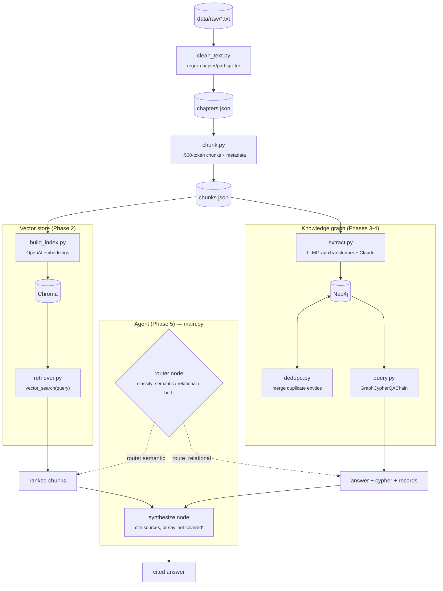

# Silmarillion Agent

A RAG + knowledge-graph system over the text of *The Silmarillion*: semantic
search via a vector store, and structured relationship queries (genealogy,
alliances, aliases) via a Neo4j knowledge graph. Full plan and phase
breakdown: [silmarillion_rag_agent_plan.md](silmarillion_rag_agent_plan.md).

## Status

| Phase | What | Status |
| --- | --- | --- |
| 1 | Ingest raw text → cleaned, chunked JSON | ✅ done |
| 2 | Embed chunks into a Chroma vector store | ✅ done |
| 3 | Extract entities/relationships into Neo4j | ✅ done |
| 4 | Cypher query layer over the graph | ✅ done |
| 5 | LangGraph agent (routes + synthesizes an answer) | ✅ done |
| 6 | Eval set + scoring | ✅ done |

`main.py` is the single "ask a question, get a cited answer" entrypoint (see
below). The vector store and graph can also still be queried independently.

Current eval results: **82% routing accuracy** (23/28), **4.46/5 avg answer
quality** (LLM-as-judge). See [data/eval/scored_results.json](data/eval/scored_results.json)
for full details, or `eval/score.py`'s printed summary for the breakdown by
category and the specific failures worth reviewing (two real ones: the
synthesize node occasionally answers from outside knowledge instead of
saying "not covered," and once misattributed a quote).

## Architecture



- **Vector store**: `text-embedding-3-large` embeddings, Chroma, persisted to
  `data/processed/chroma_db/`.
- **Graph**: Neo4j (Docker), entities constrained to a fixed schema
  (`src/graph/schema.py`: `Vala, Maia, Elf, Man, Dwarf, Place, Object, Event,
  House` / `PARENT_OF, SPOUSE_OF, RULED, CREATED, ALLIED_WITH, ENEMY_OF,
  ALSO_KNOWN_AS, ...`). Extraction runs async with bounded concurrency and is
  resumable (skips chunks already in Neo4j).
- **Config**: all env vars, model names, and paths in `src/config.py`.

## Setup

Requirements: Python 3.12+, [uv](https://docs.astral.sh/uv/), Docker.

```bash
cp .env.example .env
# fill in OPENAI_API_KEY, ANTHROPIC_API_KEY, NEO4J_PASSWORD
```

Start Neo4j (with the APOC plugin, required by both extraction and querying):

```bash
docker run -d --name silmarillion-neo4j \
  -p7474:7474 -p7687:7687 \
  -e NEO4J_AUTH=neo4j/<your NEO4J_PASSWORD> \
  -e NEO4J_PLUGINS='["apoc"]' \
  -e NEO4J_dbms_security_procedures_unrestricted=apoc.\* \
  -v "$(pwd)/data/processed/neo4j_db:/data" \
  neo4j:latest
```

`uv run` picks up dependencies automatically — no separate install step.

## Try it

### 1. Ingestion (regenerates `data/processed/*.json`)

```bash
uv run python -m src.ingest.clean_text
uv run python -m src.ingest.chunk
```

### 2. Vector search

```bash
# (re)build the index — needed once, or after re-chunking
uv run python -m src.vectorstore.build_index

# query it
uv run python -m src.vectorstore.retriever "the creation of the Silmarils"
```

Returns the top 5 matching chunks with chapter/part labels. Pure semantic
similarity — no LLM synthesis, so it won't traverse relationships (see graph
below for that).

### 3. Knowledge graph

```bash
# (re)run extraction — resumable, only processes chunks not yet in Neo4j
uv run python -m src.graph.extract

# clean up duplicate entities from inconsistent LLM spelling (run after extraction)
uv run python -m src.graph.dedupe

# ask a question in natural language — generates and runs Cypher
uv run python -m src.graph.query "Who are the children of Feanor?"
uv run python -m src.graph.query "Who are the allies of Turin's enemies?"
```

Good test questions: genealogy (`"children of X"`), aliases (`"what is X also
known as"`), multi-hop relations (`"allies of X's enemies"`).

You can also browse the graph directly at **<http://localhost:7474>**
(user `neo4j`, password from `.env`):

```cypher
MATCH (n {id: "Feanor"})-[r]-(m) RETURN n, r, m LIMIT 50
```

### 4. Agent (ask a question, get a cited answer)

```bash
uv run python main.py "Who is Beren?"
uv run python main.py "Who are the children of Feanor, and who are they allied with?"

uv run python main.py "Explain character Fingolfin"

uv run python main.py "Describe location Gondolin"

uv run python main.py "Describe timeline of First Age"

uv run python main.py "Explain Dagor Bragollach event"

# tests the "not covered" path
uv run python main.py "What color was Bilbo Baggins' waistcoat?"
```

Routes the question to the vector store, the graph, or both, then synthesizes
a cited answer — or says plainly that the text doesn't cover it, rather than
guessing.

### 5. Eval (routing accuracy + answer quality)

```bash
# runs data/eval/questions.json through the agent -> data/eval/results.json
uv run python eval/run_eval.py

# routing accuracy + LLM-as-judge quality pass -> data/eval/scored_results.json
uv run python eval/score.py
```

28 questions across the 13 categories from the plan, plus 2 deliberately
out-of-scope questions that check the agent declines rather than guesses.
Current: 82% routing accuracy, 4.46/5 avg quality.

## Backups

`data/processed/` (Chroma + Neo4j data) is gitignored — it's regenerable, but
graph extraction is expensive (~437 LLM calls), so back it up rather than
relying purely on re-running it:

```bash
docker stop silmarillion-neo4j
docker run --rm -v "$(pwd)/data/processed/neo4j_db:/data" -v "$(pwd)/backups:/backups" \
  neo4j:latest neo4j-admin database dump neo4j --overwrite-destination --to-path=/backups
docker start silmarillion-neo4j
```

Chroma is just files on disk — zip `data/processed/chroma_db/` directly.

## Project layout

```text
main.py                      # CLI entrypoint: ask(question) -> cited answer
src/
├── config.py               # env vars, model names, paths
├── ingest/
│   ├── clean_text.py       # raw .txt -> data/processed/chapters.json
│   └── chunk.py            # chapters.json -> data/processed/chunks.json
├── vectorstore/
│   ├── build_index.py      # chunks.json -> Chroma
│   └── retriever.py        # vector_search(query, k, filters) -> Documents
├── graph/
│   ├── schema.py            # allowed node labels / relationship types
│   ├── extract.py           # chunks.json -> Neo4j (LLMGraphTransformer)
│   ├── dedupe.py             # merge duplicate entity nodes
│   └── query.py             # graph_query(question) -> answer + cypher + records
└── agent/
    ├── state.py             # LangGraph state schema
    ├── nodes.py             # router / vector_retrieve / graph_retrieve / synthesize
    └── graph_app.py         # graph assembly + compile, ask(question) -> dict
eval/
├── run_eval.py             # questions.json -> results.json (route, answer, context)
└── score.py                # routing accuracy + LLM-as-judge quality -> scored_results.json
```
