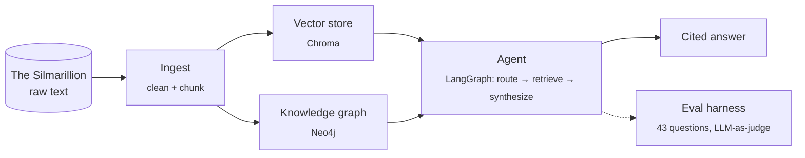
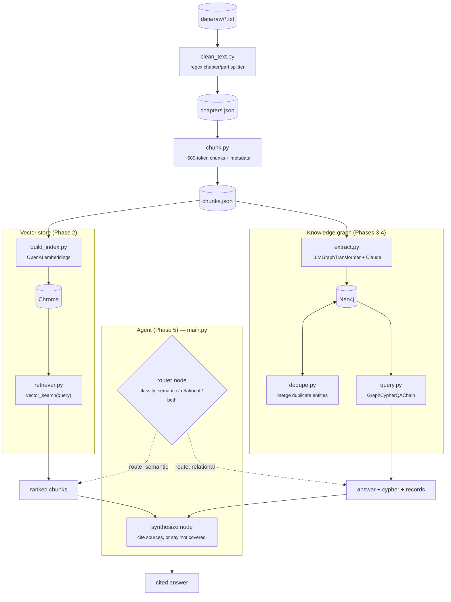
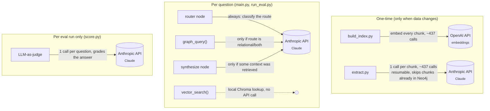

# Silmarillion Agent

A RAG + knowledge-graph system over the text of *The Silmarillion*: semantic
search via a vector store, and structured relationship queries (genealogy,
alliances, aliases) via a Neo4j knowledge graph.

All 6 build phases (ingest → vector store → knowledge graph → Cypher query
layer → LangGraph agent → eval harness) are done. `main.py` is the single
"ask a question, get a cited answer" entrypoint (see below); the vector
store and graph can also still be queried independently. Current numbers
and a running list of what's been tuned live in [Evaluation](#evaluation).

## How it works



## Architecture



- **Vector store**: `text-embedding-3-large` embeddings, Chroma, persisted to
  `data/processed/chroma_db/`.
- **Graph**: Neo4j (Docker), entities constrained to a fixed schema
  (`src/graph/schema.py`: `Vala, Maia, Elf, Man, Dwarf, Place, Object, Event,
  House` / `PARENT_OF, SPOUSE_OF, RULED, CREATED, ALLIED_WITH, ENEMY_OF,
  ALSO_KNOWN_AS, ...`). Extraction runs async with bounded concurrency and is
  resumable (skips chunks already in Neo4j).
- **Config**: all env vars, model names, and paths in `src/config.py`.

## API calls & cost

Two APIs are used, for different jobs, at very different frequencies:



So a single `main.py` question costs **1-3 Anthropic calls** (router always;
Cypher generation only if the route touches the graph; synthesis only if
context came back — the "not covered" path skips it entirely) and
**0 OpenAI calls** (vector search reuses the already-built index; OpenAI is
only hit when re-embedding chunks in `build_index.py`).

A full eval run costs more: `run_eval.py` sends all 43 questions through the
agent (up to 3 Anthropic calls each), then `score.py` grades all 43 answers
with an LLM judge (1 more Anthropic call each) — up to **~170 Anthropic
calls per eval+score cycle**. The accuracy-improvement pass this project
went through re-ran that full cycle after every change to check for
regressions (6 rounds), plus assorted one-off `graph.query`/`timeline`
testing — that repeated evaluation, not graph extraction, is the likely
source of any noticeable API spend, since extraction itself is a one-time,
resumable job that skips chunks already in Neo4j.

## Setup

Requirements: Python 3.12+, [uv](https://docs.astral.sh/uv/), Docker.

```bash
cp .env.example .env
# fill in OPENAI_API_KEY, ANTHROPIC_API_KEY, NEO4J_PASSWORD
```

Start Neo4j (with the APOC plugin, required by both extraction and querying):

```bash
docker run -d --name silmarillion-neo4j \
  -p7474:7474 -p7687:7687 \
  -e NEO4J_AUTH=neo4j/<your NEO4J_PASSWORD> \
  -e NEO4J_PLUGINS='["apoc"]' \
  -e NEO4J_dbms_security_procedures_unrestricted=apoc.\* \
  -v "$(pwd)/data/processed/neo4j_db:/data" \
  neo4j:latest
```

`uv run` picks up dependencies automatically — no separate install step.

## Try it

### 1. Ingestion (regenerates `data/processed/*.json`)

```bash
uv run python -m src.ingest.clean_text
uv run python -m src.ingest.chunk
```

### 2. Vector search

```bash
# (re)build the index — needed once, or after re-chunking
uv run python -m src.vectorstore.build_index

# query it
uv run python -m src.vectorstore.retriever "the creation of the Silmarils"
```

Returns the top 5 matching chunks with chapter/part labels. Pure semantic
similarity — no LLM synthesis, so it won't traverse relationships (see graph
below for that).

### 3. Knowledge graph

```bash
# (re)run extraction — resumable, only processes chunks not yet in Neo4j.
# Automatically runs dedupe.py at the end (merges duplicate entities from
# inconsistent LLM spelling); no separate step needed.
uv run python -m src.graph.extract

# link known events to a hand-curated era timeline (fills HAPPENED_DURING
# gaps LLM extraction can't reliably infer from implicit prose chronology)
uv run python -m src.graph.timeline

# ask a question in natural language — generates and runs Cypher
uv run python -m src.graph.query "Who are the children of Feanor?"
uv run python -m src.graph.query "Who are the allies of Turin's enemies?"
```

Good test questions: genealogy (`"children of X"`), aliases (`"what is X also
known as"`), multi-hop relations (`"allies of X's enemies"`).

You can also browse the graph directly at **<http://localhost:7474>**
(user `neo4j`, password from `.env`):

```cypher
MATCH (n {id: "Feanor"})-[r]-(m) RETURN n, r, m LIMIT 50
```

### 4. Agent (ask a question, get a cited answer)

```bash
uv run python main.py "Who is Beren?"
uv run python main.py "Who are the children of Feanor, and who are they allied with?"

uv run python main.py "Explain character Fingolfin"

uv run python main.py "Describe location Gondolin"

uv run python main.py "Describe timeline of First Age"

uv run python main.py "Explain Dagor Bragollach event"

# tests the "not covered" path
uv run python main.py "What color was Bilbo Baggins' waistcoat?"
```

Routes the question to the vector store, the graph, or both, then synthesizes
a cited answer — or says plainly that the text doesn't cover it, rather than
guessing.

### 5. Eval (routing accuracy + answer quality)

```bash
# runs data/eval/questions.json through the agent -> data/eval/results.json
uv run python eval/run_eval.py

# routing accuracy + LLM-as-judge quality pass -> data/eval/scored_results.json,
# ends with a PASS/FAIL regression gate and a non-zero exit code on failure
uv run python eval/score.py
```

43 questions, 3 per category from the plan plus 4 deliberately out-of-scope
questions that check the agent declines rather than guesses. See
[Evaluation](#evaluation) below for current numbers and cost per run.

## Evaluation

Current results (43 questions, 3 per category + 4 out-of-scope):
**93% routing accuracy** (40/43), **4.49/5 avg answer quality**
(LLM-as-judge; both fluctuate a few points run-to-run on router/judge
non-determinism). `eval/score.py` ends with a **regression gate**
(routing ≥75%, ≤3 low-quality answers) that exits non-zero on failure —
currently **PASS**. Full detail:
[data/eval/scored_results.json](data/eval/scored_results.json).

Starting point was 82% routing / 4.46 quality on a smaller 28-question set.
Changes made since, each verified by a full eval re-run:

- **Few-shot router examples** (`src/agent/nodes.py`) — 79%→89% routing.
- **`graph_query()` calls only the Cypher-generation step** directly
  instead of the full `GraphCypherQAChain`, skipping its unused built-in
  QA-synthesis call — halves LLM calls per graph question, no quality cost.
- **`src/graph/timeline.py`**, a hand-curated era timeline, since
  `HAPPENED_DURING` extraction was too sparse for ordering questions.
- **`src/graph/templates.py`**, hand-written Cypher for known question
  shapes (family tree, allies-of-enemies, aliases) as a fallback when
  LLM-generated Cypher returns nothing.
- **`extract.py` now runs dedupe automatically**, and the canonical-spelling
  choice prefers whichever variant has more diacritics (closer to the
  book's own orthography, e.g. "Fëanor" over "Feanor") instead of picking
  by graph degree alone.
- Bug fix: `synthesize_node` was storing `response.content` directly, which
  can be a list of content blocks (thinking + text) rather than a plain
  string — now uses `response.text`.

Known open issues (real, not yet fixed — flagged rather than silently
left):

- `quote_01` intermittently misattributes a quote when the exact passage
  isn't in retrieved context.
- `between_01` has been seen getting era ordering backward in one run
  despite correct underlying timeline data.

Fixed since the last full eval run (spot-checked, not yet re-verified with a
full 43-question pass):

- `rel_01`'s undirected-Cypher direction bug — `(n)-[r]-(m)` patterns let
  either named entity bind to either end of the edge, so returning the
  pattern's own aliases could misread e.g. "Thingol PARENT_OF Lúthien" as
  the reverse. `CYPHER_PROMPT` (`src/graph/query.py`) now requires
  `RETURN startNode(r).id, type(r), endNode(r).id` instead, which is
  direction-safe regardless of match order. Verified directly against
  Neo4j: `rel_01` and a second relationships-category question both now
  return/synthesize the correct direction.

## Backups

`data/processed/` (Chroma + Neo4j data) is gitignored — it's regenerable, but
graph extraction is expensive (~437 LLM calls), so back it up rather than
relying purely on re-running it:

```bash
docker stop silmarillion-neo4j
docker run --rm -v "$(pwd)/data/processed/neo4j_db:/data" -v "$(pwd)/backups:/backups" \
  neo4j:latest neo4j-admin database dump neo4j --overwrite-destination --to-path=/backups
docker start silmarillion-neo4j
```

Chroma is just files on disk — zip `data/processed/chroma_db/` directly.

## Project layout

```text
main.py                      # CLI entrypoint: ask(question) -> cited answer
src/
├── config.py               # env vars, model names, paths
├── ingest/
│   ├── clean_text.py       # raw .txt -> data/processed/chapters.json
│   └── chunk.py            # chapters.json -> data/processed/chunks.json
├── vectorstore/
│   ├── build_index.py      # chunks.json -> Chroma
│   └── retriever.py        # vector_search(query, k, filters) -> Documents
├── graph/
│   ├── schema.py            # allowed node labels / relationship types
│   ├── extract.py           # chunks.json -> Neo4j (LLMGraphTransformer)
│   ├── dedupe.py             # merge duplicate entity nodes
│   ├── timeline.py           # curated era timeline -> HAPPENED_DURING edges
│   ├── templates.py           # hand-written Cypher fallback for known question shapes
│   └── query.py             # graph_query(question) -> cypher + records
└── agent/
    ├── state.py             # LangGraph state schema
    ├── nodes.py             # router / vector_retrieve / graph_retrieve / synthesize
    └── graph_app.py         # graph assembly + compile, ask(question) -> dict
eval/
├── run_eval.py             # questions.json -> results.json (route, answer, context)
└── score.py                # routing accuracy + LLM-as-judge quality -> scored_results.json
```
